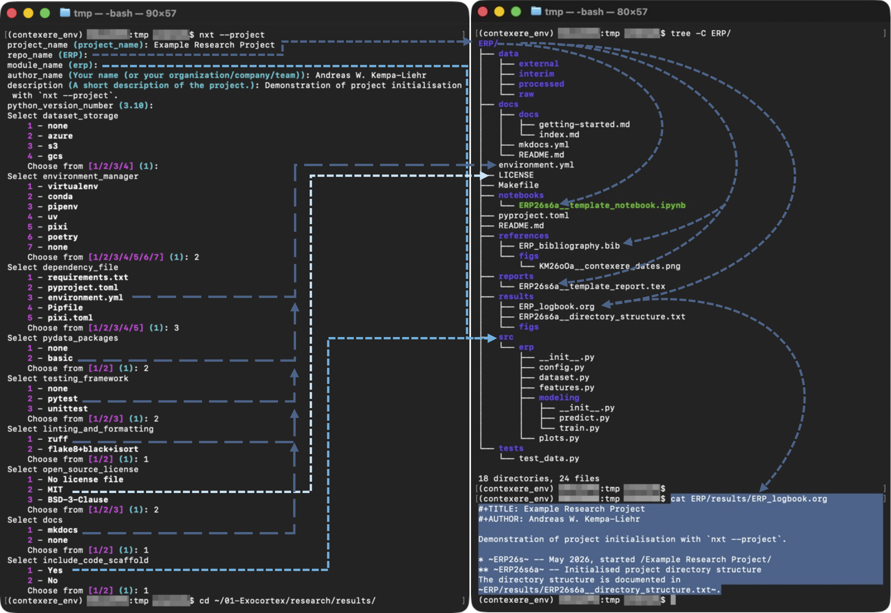

=========
contexere
=========

Naming convention for research artefacts
----------------------------------------

Scientists and engineers create a multitude of digital artefacts during their daily work:
    - experimental results,
    - simulation results,
    - literate programming notebooks analysing experiments and simulations
    - statistical models,
    - machine learning models,
    - figures,
    - tables, etc

In order to trace and track these multiple interconnected research artefacts, hierarchical naming schemes
are a powerful tool to document the connection between research artefacts, find previous research outputs, and enable reproducible research.

The following naming scheme has evolved over several years to track research artefacts of all kinds:

The general scheme is: ``PIyymDc[_x]__keyword``

-   ``PI``: [a-zA-Z]{2,} is the project identifier, which consists of at least two letters.
-   ``yy``: [0-9][0-9] are the last two digits of the years in the 21st century. I won't live beyond that. So, I do not care for following centuries.
-   ``m``: [o-z] these letters map to the respective months.
-   ``D``: [1-9,A-V] represent the 31 days of a month. Digits and upper-case characters have approximately the same height, such that this element gives a visual structure to the name, which divides the date from the daily counter.
-   ``c``: [a-z] daily counter as lower-case letter enumerating the respective database or dataset.
-   ``x``: Optional attribute being the last significant characters of the dataset, from which `DSyymde` is derived.
-   ``keyword``: One or more keywords separated by `__`.

+-------+-----------+-------+-----+-------+-----+-------+-----+
| month ``m``       | day ``d``   | day ``d``   | day ``d``   |
+=======+===========+=======+=====+=======+=====+=======+=====+
| ``o`` | January   | ``1`` |   1 | ``B`` |  11 | ``L`` |  21 |
+-------+-----------+-------+-----+-------+-----+-------+-----+
| ``p`` | February  | ``2`` |   2 | ``C`` |  12 | ``M`` |  22 |
+-------+-----------+-------+-----+-------+-----+-------+-----+
| ``q`` | March     | ``3`` |   3 | ``D`` |  13 | ``N`` |  23 |
+-------+-----------+-------+-----+-------+-----+-------+-----+
| ``r`` | April     | ``4`` |   4 | ``E`` |  14 | ``O`` |  24 |
+-------+-----------+-------+-----+-------+-----+-------+-----+
| ``s`` | May       | ``5`` |   5 | ``F`` |  15 | ``P`` |  25 |
+-------+-----------+-------+-----+-------+-----+-------+-----+
| ``t`` | June      | ``6`` |   6 | ``G`` |  16 | ``Q`` |  26 |
+-------+-----------+-------+-----+-------+-----+-------+-----+
| ``u`` | July      | ``7`` |   7 | ``H`` |  17 | ``R`` |  27 |
+-------+-----------+-------+-----+-------+-----+-------+-----+
| ``v`` | August    | ``8`` |   8 | ``I`` |  18 | ``S`` |  28 |
+-------+-----------+-------+-----+-------+-----+-------+-----+
| ``w`` | September | ``9`` |   9 | ``J`` |  19 | ``T`` |  29 |
+-------+-----------+-------+-----+-------+-----+-------+-----+
| ``x`` | October   | ``A`` |  10 | ``K`` |  20 | ``U`` |  30 |
+-------+-----------+-------+-----+-------+-----+-------+-----+
| ``y`` | November  |       |     |       |     | ``V`` |  31 |
+-------+-----------+-------+-----+-------+-----+-------+-----+
| ``z`` | December  |       |     |       |     |       |     |
+-------+-----------+-------+-----+-------+-----+-------+-----+

- The first dataset created on Friday 01.01.2021 would be named ``DS21o1a``.
- The second dataset created on the same day would be named ``DS21o1b``.
- An analysis (e.g. Jupyter notebook) of the first data set started after the second data set had been created would be named ``DS21o1c_a``. Exported figures of this analysis should be named ``DS21o1c_a__[plottype].[filetype]``.
- An analysis of data set ``DS21o1b`` started on 2nd January should be named ``DS21o2a_1b``.
- An meta analysis of ``DS21o1c_a`` and ``DS21o2a_1b`` started on 11th February should be named ``DS21pBa_o1c_2a``.

Installation
============
The module ``contexere`` can be installed from PyPi::

    pip install contexere

Usage
=====
The project provides the command line tool ``nxt``::

    usage: nxt [-h] [--version] [-g GROUP] [-k KEYWORDS [KEYWORDS ...]] [-l] [-p] [-r [REFERENCE]] [-s] [-u] [-v] [-vv] [target]

    Suggest name for research artefact

    positional arguments:
      target                Either a project identifier, filename, or folder

    options:
      -h, --help            show this help message and exit
      --version             show program's version number and exit
      -g, --group GROUP     Project identifier for which the next research artefact GROUP will be suggested
      -k, --keywords KEYWORDS [KEYWORDS ...]
                            Optional argument for --clone adding one or more keywords to the filename
      -l, --local           Inspect files in current working dir only
      -p, --project         Create new project directory structure
      -r, --reference [REFERENCE]
                            Optional argument indicating reference of cloned file if used without arguments or accepting comma
                            separated list of references.
      -s, --summary         Summarise files following the naming convention
      -u, --utc             Generate timestamp with respect to UTC (default is local timezone)
      -v, --verbose         set loglevel to INFO
      -vv, --very-verbose   set loglevel to DEBUG

Calling the tool without any arguments in an empty directory returns the date abbreviation of today appended by the first daily counter (``a``)::

    $ nxt
    26s6a

The date abbreviation indicates that the ``nxt`` command in this example was called on 6 May 2026.
The following examples assume that all following commands of ``nxt`` were also called on 6 May 2026.

Calling the ``nxt`` command at the root of a directory structure, which contains files following the naming scheme,
finds the latest research artefact group (RAG) and uses the respective project identifier to suggest a new RAG::

    $ nxt --project  # Followed by a dialog specifying the new project ERP (Example Research Project)
    $ cd ERP
    $ nxt
    ERP26s6b

The suggested RAG ``ERP26s6b`` is the second RAG (``b``) of 9 May 2026, because ``nxt --project`` creates template
files starting with ``ERP26s6a`` like ``notebooks/ERP26s6a__template_notebook.ipynb``.

An overview of the existing files associated with RAGs gives the command ``nxt --summary``,
which provides a tabular output of all RAGs in the directory hierarchy::

    $ nxt --summary
    Project RAGs Files Latest
    ERP        1     4  26s6a
    KM         1     1  26oOa

Let's assume that ``ERP`` project has been put under git revision control and
we want to create a clone of the Jupyter notebook template::

    $ nxt notebooks/ERP26s6a__template_notebook.ipynb --keywords poc
    [main .......] Cloned from ERP26s6a__template_notebook.ipynb
     1 file changed, 54 insertions(+)
     create mode 100755 notebooks ERP2RP26s6b_poc.ipynb
    Added cloned file ERP2RP26s6b_poc.ipynb to the git repository.

The cloned file is added automatically to the git repository of the project such that all edits can be tracked systematically.

Let's assume that we want to follow-up with a visualisation of data or results generated by ``ERP26s6b__poc.ipynb``.
In this case, we might want to continue from the configuration provided in ``ERP26s6b__poc.ipynb``.
The command::

    $ nxt notebooks/ERP26s6b__poc.ipynb --reference --keywords visualisation

Creates a copy of ``ERP26s6b__poc.ipynb`` in directory notebooks named::

    ERP26s6c_b__visualisation.ipynb

Note, that the cloned RAG references the original RAG but abbreviates the reference.
In another rapid development cycle, we might want to continue from ``ERP26s6b``,
but this time using additional data provided by a completely different project ``DS25zAa``.
The commands::

    $ cd notebooks
    $ nxt ERP26s6b__poc.ipynb --reference s6b,DS25zAa --keywords simulation

Create a fourth notebook named::

    ERP26s6d_b_DS25zAa__simulation.ipynb

Again providing an efficient referencing of the input RAGs and thus creating a directed graph of RAGs.
Note, that the provided reference ``s6b`` is an abbreviation of ``ERP26s6b``.